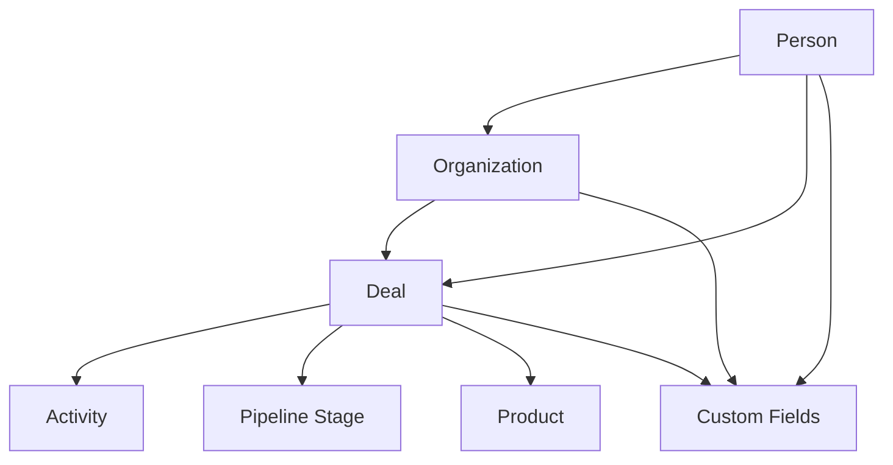
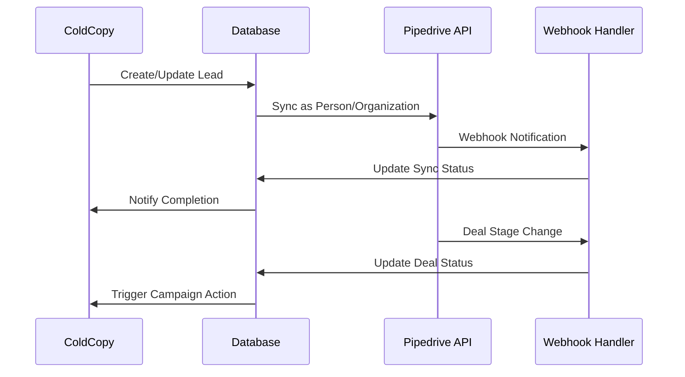

# Pipedrive Integration Architecture

## Table of Contents
1. [Overview](#overview)
2. [Pipedrive API Capabilities](#pipedrive-api-capabilities)
3. [Authentication Architecture](#authentication-architecture)
4. [Data Models](#data-models)
5. [Rate Limiting Strategy](#rate-limiting-strategy)
6. [Webhook System](#webhook-system)
7. [Integration Approach](#integration-approach)
8. [Custom Fields & Field Mapping](#custom-fields--field-mapping)
9. [Activity Tracking & Timeline Sync](#activity-tracking--timeline-sync)
10. [Pipeline Management](#pipeline-management)
11. [Bulk Operations & Conflict Resolution](#bulk-operations--conflict-resolution)
12. [Technical Implementation](#technical-implementation)
13. [Error Handling & Resilience](#error-handling--resilience)
14. [Security Considerations](#security-considerations)
15. [Monitoring & Analytics](#monitoring--analytics)

## Overview

This document outlines the comprehensive integration architecture between ColdCopy and Pipedrive CRM. The integration enables bidirectional data synchronization, automated lead management, and unified workflow orchestration while maintaining data integrity and respecting both platforms' constraints.

### Integration Goals
- **Lead Synchronization**: Automatic sync of leads from ColdCopy to Pipedrive as Persons/Organizations
- **Deal Management**: Convert qualified leads to deals with proper pipeline placement
- **Activity Tracking**: Sync email activities, calls, and engagement metrics
- **Real-time Updates**: Leverage webhooks for immediate data synchronization
- **Field Mapping**: Flexible custom field mapping between platforms
- **Workflow Automation**: Trigger ColdCopy campaigns based on Pipedrive stage changes

## Pipedrive API Capabilities

### API Versions
- **API v1**: Primary version with comprehensive endpoint coverage
- **API v2**: Stable endpoints with improved performance and lower token costs
- **RESTful Architecture**: JSON-based with CORS support
- **Client Libraries**: Official Node.js and PHP SDKs available

### Core Endpoints
```typescript
// Primary endpoints for ColdCopy integration
const PIPEDRIVE_ENDPOINTS = {
  // Core entities
  persons: '/api/v1/persons',
  organizations: '/api/v1/organizations', 
  deals: '/api/v1/deals',
  activities: '/api/v1/activities',
  
  // Configuration
  pipelines: '/api/v1/pipelines',
  stages: '/api/v1/stages',
  dealFields: '/api/v1/dealFields',
  personFields: '/api/v1/personFields',
  organizationFields: '/api/v1/organizationFields',
  
  // Enhanced endpoints (v2)
  search: '/api/v2/itemSearch',
  bulk: '/api/v2/bulk',
  
  // Webhooks
  webhooks: '/api/v1/webhooks'
};
```

### Entity Relationships


## Authentication Architecture

### OAuth 2.0 Implementation (Recommended)
```typescript
interface PipedriveOAuthConfig {
  clientId: string;
  clientSecret: string;
  redirectUri: string;
  scopes: string[];
  authUrl: 'https://oauth.pipedrive.com/oauth/authorize';
  tokenUrl: 'https://oauth.pipedrive.com/oauth/token';
}

class PipedriveOAuth {
  private config: PipedriveOAuthConfig;
  
  async getAuthorizationUrl(state: string): Promise<string> {
    const params = new URLSearchParams({
      response_type: 'code',
      client_id: this.config.clientId,
      redirect_uri: this.config.redirectUri,
      scope: this.config.scopes.join(' '),
      state
    });
    
    return `${this.config.authUrl}?${params.toString()}`;
  }
  
  async exchangeCodeForTokens(code: string): Promise<PipedriveTokens> {
    // Implementation for token exchange
  }
  
  async refreshTokens(refreshToken: string): Promise<PipedriveTokens> {
    // Implementation for token refresh
  }
}
```

### API Token Fallback
```typescript
interface PipedriveTokenAuth {
  apiToken: string;
  companyDomain: string;
}

// For simpler integrations or testing
const apiTokenAuth = {
  headers: {
    'x-api-token': process.env.PIPEDRIVE_API_TOKEN
  }
};
```

### Token Storage Strategy
```sql
-- Enhanced auth tokens table
CREATE TABLE pipedrive_auth (
  workspace_id UUID REFERENCES workspaces(id) ON DELETE CASCADE,
  access_token TEXT NOT NULL,
  refresh_token TEXT,
  token_type VARCHAR(50) DEFAULT 'Bearer',
  expires_at TIMESTAMP WITH TIME ZONE,
  scope TEXT[],
  company_domain VARCHAR(255) NOT NULL,
  api_token TEXT, -- Fallback for API token auth
  created_at TIMESTAMP WITH TIME ZONE DEFAULT NOW(),
  updated_at TIMESTAMP WITH TIME ZONE DEFAULT NOW(),
  PRIMARY KEY (workspace_id)
);
```

## Data Models

### Person Entity Mapping
```typescript
interface PipedrivePerson {
  id: number;
  name: string;
  first_name: string;
  last_name: string;
  phone: string[];
  email: string[];
  org_id: number;
  owner_id: number;
  add_time: string;
  update_time: string;
  visible_to: string;
  custom_fields: Record<string, any>;
}

interface ColdCopyPersonMapping {
  pipedrive_person_id: number;
  coldcopy_lead_id: string;
  email_primary: string;
  phone_primary: string;
  organization_name?: string;
  job_title?: string;
  enrichment_data: Record<string, any>;
  sync_status: 'pending' | 'synced' | 'error';
  last_sync: string;
}
```

### Organization Entity Mapping
```typescript
interface PipedriveOrganization {
  id: number;
  name: string;
  people_count: number;
  owner_id: number;
  address: string;
  add_time: string;
  update_time: string;
  visible_to: string;
  custom_fields: Record<string, any>;
}

interface ColdCopyOrganizationMapping {
  pipedrive_org_id: number;
  company_domain: string;
  employee_count?: number;
  industry?: string;
  annual_revenue?: number;
  technology_stack?: string[];
  enrichment_data: Record<string, any>;
}
```

### Deal Entity Mapping
```typescript
interface PipedriveDeal {
  id: number;
  title: string;
  value: number;
  currency: string;
  person_id: number;
  org_id: number;
  stage_id: number;
  status: 'open' | 'won' | 'lost' | 'deleted';
  probability: number;
  add_time: string;
  update_time: string;
  stage_change_time: string;
  won_time: string;
  lost_time: string;
  custom_fields: Record<string, any>;
}
```

### Activity Entity Structure
```typescript
interface PipedriveActivity {
  id: number;
  subject: string;
  type: string; // 'call', 'meeting', 'task', 'deadline', 'email', 'lunch'
  due_date: string;
  due_time: string;
  duration: string;
  person_id: number;
  org_id: number;
  deal_id: number;
  done: boolean;
  add_time: string;
  marked_as_done_time: string;
  note: string;
  custom_fields: Record<string, any>;
}
```

## Rate Limiting Strategy

### Token Budget System
```typescript
interface TokenBudgetManager {
  dailyBudget: number; // 30,000 × plan_multiplier × seats
  currentUsage: number;
  resetTime: Date;
  
  async checkTokenAvailability(cost: number): Promise<boolean>;
  async consumeTokens(cost: number): Promise<void>;
  async getRemainingTokens(): Promise<number>;
}

// Token costs per endpoint (examples)
const TOKEN_COSTS = {
  'GET /persons': 1,
  'POST /persons': 2,
  'PUT /persons': 2,
  'GET /deals': 1,
  'POST /deals': 3,
  'GET /activities': 1,
  'POST /activities': 2,
  'GET /search': 5, // Higher cost for complex operations
};
```

### Rate Limiter Implementation
```typescript
class PipedriveRateLimiter {
  private tokenBucket: Map<string, number> = new Map();
  private lastRefill: Map<string, number> = new Map();
  
  async checkLimit(workspaceId: string, cost: number = 1): Promise<boolean> {
    const now = Date.now();
    const key = `pipedrive:${workspaceId}`;
    
    // Burst limit: 100 requests per 2 seconds
    const burstLimit = 100;
    const windowMs = 2000;
    
    // Daily limit check
    const dailyUsage = await this.getDailyUsage(workspaceId);
    const dailyLimit = await this.getDailyLimit(workspaceId);
    
    if (dailyUsage + cost > dailyLimit) {
      throw new RateLimitError('Daily token limit exceeded');
    }
    
    // Burst limit check
    const current = this.tokenBucket.get(key) || burstLimit;
    const lastRefill = this.lastRefill.get(key) || now;
    
    // Refill bucket based on time elapsed
    const timePassed = now - lastRefill;
    const tokensToAdd = Math.floor(timePassed / windowMs) * burstLimit;
    const newTokens = Math.min(burstLimit, current + tokensToAdd);
    
    if (newTokens < cost) {
      throw new RateLimitError('Burst rate limit exceeded');
    }
    
    this.tokenBucket.set(key, newTokens - cost);
    this.lastRefill.set(key, now);
    
    return true;
  }
}
```

## Webhook System

### Webhook Configuration
```typescript
interface PipedriveWebhookConfig {
  eventAction: 'added' | 'updated' | 'deleted' | 'merged';
  eventObject: 'person' | 'organization' | 'deal' | 'activity' | 'user';
  subscriptionUrl: string;
  httpAuth?: {
    username: string;
    password: string;
  };
  version: '1.0' | '2.0';
}

class PipedriveWebhookManager {
  async createWebhook(config: PipedriveWebhookConfig): Promise<WebhookResponse> {
    await this.rateLimiter.checkLimit(config.workspaceId, 2);
    
    return this.apiClient.post('/webhooks', {
      subscription_url: config.subscriptionUrl,
      event_action: config.eventAction,
      event_object: config.eventObject,
      http_auth_user: config.httpAuth?.username,
      http_auth_password: config.httpAuth?.password,
      version: config.version
    });
  }
  
  async handleWebhook(payload: PipedriveWebhookPayload): Promise<void> {
    const { event, current, previous } = payload;
    
    switch (`${event.action}.${event.object}`) {
      case 'added.person':
        await this.handlePersonAdded(current);
        break;
      case 'updated.deal':
        await this.handleDealUpdated(current, previous);
        break;
      case 'deleted.organization':
        await this.handleOrganizationDeleted(previous);
        break;
      default:
        console.warn(`Unhandled webhook event: ${event.action}.${event.object}`);
    }
  }
}
```

### Webhook Security & Validation
```typescript
class WebhookValidator {
  async validateSignature(payload: string, signature: string): Promise<boolean> {
    const expectedSignature = crypto
      .createHmac('sha256', process.env.PIPEDRIVE_WEBHOOK_SECRET!)
      .update(payload)
      .digest('hex');
    
    return crypto.timingSafeEqual(
      Buffer.from(signature),
      Buffer.from(expectedSignature)
    );
  }
  
  async validateOrigin(request: Request): Promise<boolean> {
    // Additional validation for webhook origin
    const allowedIPs = ['185.166.142.0/24', '185.166.143.0/24']; // Pipedrive IPs
    // Implementation for IP validation
  }
}
```

### Retry Logic & Ban Prevention
```typescript
class WebhookReliabilityManager {
  private banCounter: Map<string, number> = new Map();
  private bannedUntil: Map<string, Date> = new Map();
  
  async processWebhook(webhookId: string, payload: any): Promise<boolean> {
    try {
      // Check if webhook is banned
      if (this.isBanned(webhookId)) {
        throw new Error('Webhook is currently banned');
      }
      
      await this.handleWebhookPayload(payload);
      
      // Reset ban counter on success
      this.banCounter.delete(webhookId);
      return true;
      
    } catch (error) {
      // Increment ban counter
      const currentCount = this.banCounter.get(webhookId) || 0;
      this.banCounter.set(webhookId, currentCount + 1);
      
      // Ban webhook if it reaches 10 failures
      if (currentCount + 1 >= 10) {
        const banUntil = new Date(Date.now() + 30 * 60 * 1000); // 30 minutes
        this.bannedUntil.set(webhookId, banUntil);
      }
      
      throw error;
    }
  }
}
```

## Integration Approach

### Synchronization Strategy
```typescript
enum SyncDirection {
  COLDCOPY_TO_PIPEDRIVE = 'cp_to_pd',
  PIPEDRIVE_TO_COLDCOPY = 'pd_to_cp',
  BIDIRECTIONAL = 'bidirectional'
}

interface SyncConfiguration {
  workspaceId: string;
  direction: SyncDirection;
  entities: ('persons' | 'organizations' | 'deals' | 'activities')[];
  syncFrequency: 'realtime' | 'hourly' | 'daily';
  conflictResolution: 'latest_wins' | 'pipedrive_wins' | 'coldcopy_wins' | 'manual';
  fieldMappings: FieldMapping[];
}

class PipedriveSyncOrchestrator {
  async performFullSync(config: SyncConfiguration): Promise<SyncResult> {
    const results: SyncResult = {
      persons: { created: 0, updated: 0, errors: 0 },
      organizations: { created: 0, updated: 0, errors: 0 },
      deals: { created: 0, updated: 0, errors: 0 },
      activities: { created: 0, updated: 0, errors: 0 }
    };
    
    for (const entity of config.entities) {
      try {
        switch (entity) {
          case 'persons':
            results.persons = await this.syncPersons(config);
            break;
          case 'organizations':
            results.organizations = await this.syncOrganizations(config);
            break;
          case 'deals':
            results.deals = await this.syncDeals(config);
            break;
          case 'activities':
            results.activities = await this.syncActivities(config);
            break;
        }
      } catch (error) {
        console.error(`Error syncing ${entity}:`, error);
        results[entity].errors++;
      }
    }
    
    return results;
  }
}
```

### Data Flow Architecture


## Custom Fields & Field Mapping

### Field Mapping Configuration
```typescript
interface FieldMapping {
  id: string;
  sourceField: string;
  targetField: string;
  sourceSystem: 'coldcopy' | 'pipedrive';
  targetSystem: 'coldcopy' | 'pipedrive';
  fieldType: PipedriveFieldType;
  transformation?: FieldTransformation;
  required: boolean;
  bidirectional: boolean;
}

enum PipedriveFieldType {
  VARCHAR = 'varchar',
  TEXT = 'text',
  INT = 'int',
  DECIMAL = 'decimal',
  DATE = 'date',
  DATETIME = 'datetime',
  TIME = 'time',
  PHONE = 'phone',
  EMAIL = 'email',
  ENUM = 'enum',
  SET = 'set',
  MONETARY = 'monetary',
  USER = 'user',
  ORGANIZATION = 'org',
  PERSON = 'people',
  VISIBLE_TO = 'visible_to'
}

interface FieldTransformation {
  type: 'format' | 'lookup' | 'calculation' | 'conditional';
  config: Record<string, any>;
}
```

### Custom Field Management
```typescript
class PipedriveFieldManager {
  async createCustomField(
    entity: 'person' | 'organization' | 'deal',
    field: CustomFieldDefinition
  ): Promise<CustomField> {
    const endpoint = `/${entity}Fields`;
    
    return this.apiClient.post(endpoint, {
      name: field.name,
      field_type: field.type,
      options: field.options,
      add_visible_flag: field.visible
    });
  }
  
  async mapFieldValue(
    value: any,
    mapping: FieldMapping
  ): Promise<any> {
    if (!mapping.transformation) {
      return value;
    }
    
    switch (mapping.transformation.type) {
      case 'format':
        return this.formatValue(value, mapping.transformation.config);
      case 'lookup':
        return this.lookupValue(value, mapping.transformation.config);
      case 'calculation':
        return this.calculateValue(value, mapping.transformation.config);
      case 'conditional':
        return this.conditionalValue(value, mapping.transformation.config);
      default:
        return value;
    }
  }
}
```

### Field Mapping Database Schema
```sql
CREATE TABLE pipedrive_field_mappings (
  id UUID PRIMARY KEY DEFAULT gen_random_uuid(),
  workspace_id UUID REFERENCES workspaces(id) ON DELETE CASCADE,
  source_field VARCHAR(255) NOT NULL,
  target_field VARCHAR(255) NOT NULL,
  source_system VARCHAR(50) NOT NULL CHECK (source_system IN ('coldcopy', 'pipedrive')),
  target_system VARCHAR(50) NOT NULL CHECK (target_system IN ('coldcopy', 'pipedrive')),
  field_type VARCHAR(50) NOT NULL,
  transformation JSONB,
  required BOOLEAN DEFAULT FALSE,
  bidirectional BOOLEAN DEFAULT FALSE,
  created_at TIMESTAMP WITH TIME ZONE DEFAULT NOW(),
  updated_at TIMESTAMP WITH TIME ZONE DEFAULT NOW()
);

CREATE INDEX idx_pipedrive_field_mappings_workspace ON pipedrive_field_mappings(workspace_id);
```

## Activity Tracking & Timeline Sync

### Activity Synchronization
```typescript
interface ActivitySyncManager {
  async syncEmailActivity(emailEvent: EmailEvent): Promise<PipedriveActivity> {
    const activity = {
      subject: `Email: ${emailEvent.subject}`,
      type: 'email',
      due_date: emailEvent.sent_at,
      person_id: await this.getPersonId(emailEvent.recipient_email),
      deal_id: await this.getDealId(emailEvent.campaign_id),
      done: emailEvent.status === 'delivered',
      note: this.formatEmailNote(emailEvent)
    };
    
    return this.createActivity(activity);
  }
  
  async syncCallActivity(callLog: CallLog): Promise<PipedriveActivity> {
    const activity = {
      subject: `Call: ${callLog.duration}m`,
      type: 'call',
      due_date: callLog.started_at,
      duration: `${callLog.duration}:00`,
      person_id: await this.getPersonId(callLog.contact_email),
      done: true,
      note: callLog.notes
    };
    
    return this.createActivity(activity);
  }
}
```

### Timeline Integration
```typescript
class TimelineSync {
  async syncTimeline(contactId: string): Promise<TimelineEntry[]> {
    const activities = await this.pipedriveClient.getActivities({
      person_id: contactId,
      start: 0,
      limit: 500
    });
    
    const timelineEntries = activities.data.map(activity => ({
      id: `pipedrive_${activity.id}`,
      type: this.mapActivityType(activity.type),
      timestamp: new Date(activity.add_time),
      title: activity.subject,
      description: activity.note,
      metadata: {
        pipedrive_id: activity.id,
        done: activity.done,
        duration: activity.duration
      }
    }));
    
    return timelineEntries;
  }
  
  private mapActivityType(pipedriveType: string): TimelineEventType {
    const typeMap = {
      'email': 'EMAIL_SENT',
      'call': 'CALL_MADE',
      'meeting': 'MEETING_SCHEDULED',
      'task': 'TASK_CREATED',
      'deadline': 'DEADLINE_SET'
    };
    
    return typeMap[pipedriveType] || 'ACTIVITY_LOGGED';
  }
}
```

## Pipeline Management

### Pipeline Stage Mapping
```typescript
interface PipelineStageMapping {
  workspaceId: string;
  pipedriveStageId: number;
  coldcopyStatus: LeadStatus;
  triggerActions: PipelineAction[];
  probability: number;
}

enum PipelineAction {
  START_CAMPAIGN = 'start_campaign',
  STOP_CAMPAIGN = 'stop_campaign',
  SEND_NOTIFICATION = 'send_notification',
  UPDATE_LEAD_SCORE = 'update_lead_score',
  ASSIGN_OWNER = 'assign_owner'
}

class PipelineManager {
  async handleStageChange(
    dealId: number,
    newStageId: number,
    previousStageId: number
  ): Promise<void> {
    const mapping = await this.getStageMapping(newStageId);
    if (!mapping) return;
    
    for (const action of mapping.triggerActions) {
      await this.executeAction(action, dealId, mapping);
    }
  }
  
  async executeAction(
    action: PipelineAction,
    dealId: number,
    mapping: PipelineStageMapping
  ): Promise<void> {
    switch (action) {
      case PipelineAction.START_CAMPAIGN:
        await this.startCampaignForDeal(dealId);
        break;
      case PipelineAction.STOP_CAMPAIGN:
        await this.stopCampaignForDeal(dealId);
        break;
      case PipelineAction.UPDATE_LEAD_SCORE:
        await this.updateLeadScore(dealId, mapping.probability);
        break;
      // Additional actions...
    }
  }
}
```

### Stage History Tracking
```sql
CREATE TABLE pipedrive_stage_history (
  id UUID PRIMARY KEY DEFAULT gen_random_uuid(),
  workspace_id UUID REFERENCES workspaces(id) ON DELETE CASCADE,
  deal_id INTEGER NOT NULL,
  stage_id INTEGER NOT NULL,
  previous_stage_id INTEGER,
  changed_at TIMESTAMP WITH TIME ZONE NOT NULL,
  duration_in_stage INTERVAL,
  changed_by_user_id INTEGER,
  probability INTEGER,
  deal_value DECIMAL(15,2),
  created_at TIMESTAMP WITH TIME ZONE DEFAULT NOW()
);

CREATE INDEX idx_pipedrive_stage_history_deal ON pipedrive_stage_history(deal_id);
CREATE INDEX idx_pipedrive_stage_history_workspace ON pipedrive_stage_history(workspace_id);
```

## Bulk Operations & Conflict Resolution

### Bulk Operation Strategy
```typescript
interface BulkOperationConfig {
  batchSize: number;
  maxConcurrency: number;
  retryAttempts: number;
  backoffMultiplier: number;
}

class PipedriveBulkManager {
  private config: BulkOperationConfig = {
    batchSize: 100,
    maxConcurrency: 5,
    retryAttempts: 3,
    backoffMultiplier: 2
  };
  
  async bulkCreatePersons(persons: PersonData[]): Promise<BulkResult> {
    const batches = this.chunkArray(persons, this.config.batchSize);
    const results: BulkResult = { success: 0, failed: 0, errors: [] };
    
    // Process batches with concurrency control
    const semaphore = new Semaphore(this.config.maxConcurrency);
    
    await Promise.allSettled(batches.map(async (batch) => {
      await semaphore.acquire();
      try {
        const batchResult = await this.processBatch(batch);
        results.success += batchResult.success;
        results.failed += batchResult.failed;
        results.errors.push(...batchResult.errors);
      } finally {
        semaphore.release();
      }
    }));
    
    return results;
  }
  
  async processBatch(batch: PersonData[]): Promise<BatchResult> {
    let attempt = 0;
    
    while (attempt < this.config.retryAttempts) {
      try {
        // Use Pipedrive bulk API if available, otherwise process individually
        const response = await this.apiClient.post('/persons/bulk', {
          data: batch
        });
        
        return this.processBulkResponse(response);
      } catch (error) {
        attempt++;
        if (attempt >= this.config.retryAttempts) {
          throw error;
        }
        
        // Exponential backoff
        const delay = Math.pow(this.config.backoffMultiplier, attempt) * 1000;
        await this.sleep(delay);
      }
    }
  }
}
```

### Conflict Resolution
```typescript
enum ConflictResolution {
  LATEST_WINS = 'latest_wins',
  PIPEDRIVE_WINS = 'pipedrive_wins',
  COLDCOPY_WINS = 'coldcopy_wins',
  MANUAL = 'manual',
  FIELD_LEVEL = 'field_level'
}

interface ConflictResolver {
  async resolveConflict(
    coldcopyRecord: any,
    pipedriveRecord: any,
    strategy: ConflictResolution
  ): Promise<any> {
    switch (strategy) {
      case ConflictResolution.LATEST_WINS:
        return this.resolveByTimestamp(coldcopyRecord, pipedriveRecord);
      
      case ConflictResolution.FIELD_LEVEL:
        return this.resolveByField(coldcopyRecord, pipedriveRecord);
      
      case ConflictResolution.MANUAL:
        return this.flagForManualResolution(coldcopyRecord, pipedriveRecord);
      
      default:
        return strategy === ConflictResolution.PIPEDRIVE_WINS 
          ? pipedriveRecord 
          : coldcopyRecord;
    }
  }
  
  private async resolveByField(
    coldcopyRecord: any,
    pipedriveRecord: any
  ): Promise<any> {
    const resolved = { ...coldcopyRecord };
    
    // Field-level conflict resolution rules
    const fieldRules = {
      email: 'coldcopy_wins', // ColdCopy has better email validation
      phone: 'pipedrive_wins', // Pipedrive may have more updated contact info
      company: 'latest_wins',
      job_title: 'latest_wins'
    };
    
    for (const [field, rule] of Object.entries(fieldRules)) {
      if (coldcopyRecord[field] !== pipedriveRecord[field]) {
        resolved[field] = this.applyFieldRule(
          coldcopyRecord[field],
          pipedriveRecord[field],
          rule,
          coldcopyRecord.updated_at,
          pipedriveRecord.update_time
        );
      }
    }
    
    return resolved;
  }
}
```

### Conflict Detection & Logging
```sql
CREATE TABLE sync_conflicts (
  id UUID PRIMARY KEY DEFAULT gen_random_uuid(),
  workspace_id UUID REFERENCES workspaces(id) ON DELETE CASCADE,
  entity_type VARCHAR(50) NOT NULL,
  entity_id VARCHAR(255) NOT NULL,
  pipedrive_id INTEGER,
  conflict_type VARCHAR(100) NOT NULL,
  coldcopy_data JSONB NOT NULL,
  pipedrive_data JSONB NOT NULL,
  resolution_status VARCHAR(50) DEFAULT 'pending',
  resolved_data JSONB,
  resolved_at TIMESTAMP WITH TIME ZONE,
  resolved_by UUID REFERENCES users(id),
  created_at TIMESTAMP WITH TIME ZONE DEFAULT NOW()
);
```

## Technical Implementation

### Core Client Implementation
```typescript
class PipedriveClient {
  private baseUrl: string;
  private authManager: PipedriveAuthManager;
  private rateLimiter: PipedriveRateLimiter;
  private retryManager: RetryManager;
  
  constructor(config: PipedriveClientConfig) {
    this.baseUrl = `https://${config.companyDomain}.pipedrive.com`;
    this.authManager = new PipedriveAuthManager(config.auth);
    this.rateLimiter = new PipedriveRateLimiter();
    this.retryManager = new RetryManager();
  }
  
  async request<T>(
    method: string,
    endpoint: string,
    data?: any,
    options?: RequestOptions
  ): Promise<T> {
    await this.rateLimiter.checkLimit(options?.workspaceId);
    
    const headers = await this.authManager.getHeaders();
    const config = {
      method,
      url: `${this.baseUrl}${endpoint}`,
      headers,
      data,
      timeout: options?.timeout || 10000
    };
    
    return this.retryManager.execute(async () => {
      const response = await axios(config);
      return response.data;
    });
  }
  
  // Entity-specific methods
  async getPersons(params?: GetPersonsParams): Promise<PersonsResponse> {
    return this.request('GET', '/api/v1/persons', null, { params });
  }
  
  async createPerson(person: CreatePersonData): Promise<PersonResponse> {
    return this.request('POST', '/api/v1/persons', person);
  }
  
  async updatePerson(id: number, updates: UpdatePersonData): Promise<PersonResponse> {
    return this.request('PUT', `/api/v1/persons/${id}`, updates);
  }
}
```

### Service Layer Architecture
```typescript
interface PipedriveService {
  // Person operations
  syncPersonFromLead(lead: Lead): Promise<PipedrivePerson>;
  syncPersonToLead(person: PipedrivePerson): Promise<Lead>;
  
  // Organization operations
  syncOrganizationFromCompany(company: Company): Promise<PipedriveOrganization>;
  
  // Deal operations
  createDealFromLead(lead: Lead, stageId: number): Promise<PipedriveDeal>;
  updateDealStage(dealId: number, stageId: number): Promise<PipedriveDeal>;
  
  // Activity operations
  logEmailActivity(emailEvent: EmailEvent): Promise<PipedriveActivity>;
  logCallActivity(callEvent: CallEvent): Promise<PipedriveActivity>;
  
  // Bulk operations
  bulkSyncPersons(leads: Lead[]): Promise<BulkSyncResult>;
  
  // Configuration
  setupWebhooks(workspaceId: string): Promise<WebhookSetupResult>;
  configureFieldMappings(mappings: FieldMapping[]): Promise<void>;
}
```

## Error Handling & Resilience

### Error Classification & Handling
```typescript
class PipedriveErrorHandler {
  async handleError(error: any, context: ErrorContext): Promise<ErrorResponse> {
    const errorType = this.classifyError(error);
    
    switch (errorType) {
      case 'RATE_LIMIT':
        return this.handleRateLimit(error, context);
      case 'AUTH_ERROR':
        return this.handleAuthError(error, context);
      case 'VALIDATION_ERROR':
        return this.handleValidationError(error, context);
      case 'NETWORK_ERROR':
        return this.handleNetworkError(error, context);
      case 'SERVER_ERROR':
        return this.handleServerError(error, context);
      default:
        return this.handleUnknownError(error, context);
    }
  }
  
  private async handleRateLimit(error: any, context: ErrorContext): Promise<ErrorResponse> {
    const retryAfter = error.response?.headers['retry-after'] || 60;
    
    // Schedule retry
    await this.scheduleRetry(context.operation, retryAfter * 1000);
    
    return {
      type: 'RECOVERABLE',
      message: `Rate limit exceeded. Retrying in ${retryAfter} seconds.`,
      retryAfter
    };
  }
}
```

### Circuit Breaker Pattern
```typescript
class CircuitBreaker {
  private failures = 0;
  private lastFailure: Date | null = null;
  private state: 'CLOSED' | 'OPEN' | 'HALF_OPEN' = 'CLOSED';
  
  constructor(
    private failureThreshold = 5,
    private recoveryTimeout = 60000
  ) {}
  
  async execute<T>(operation: () => Promise<T>): Promise<T> {
    if (this.state === 'OPEN') {
      if (Date.now() - this.lastFailure!.getTime() > this.recoveryTimeout) {
        this.state = 'HALF_OPEN';
      } else {
        throw new Error('Circuit breaker is OPEN');
      }
    }
    
    try {
      const result = await operation();
      this.onSuccess();
      return result;
    } catch (error) {
      this.onFailure();
      throw error;
    }
  }
  
  private onSuccess(): void {
    this.failures = 0;
    this.state = 'CLOSED';
  }
  
  private onFailure(): void {
    this.failures++;
    this.lastFailure = new Date();
    
    if (this.failures >= this.failureThreshold) {
      this.state = 'OPEN';
    }
  }
}
```

## Security Considerations

### Data Encryption & Storage
```typescript
class SecureTokenStorage {
  private encryptionKey: string;
  
  async storeTokens(workspaceId: string, tokens: PipedriveTokens): Promise<void> {
    const encrypted = {
      access_token: this.encrypt(tokens.access_token),
      refresh_token: tokens.refresh_token ? this.encrypt(tokens.refresh_token) : null,
      expires_at: tokens.expires_at,
      scope: tokens.scope
    };
    
    await this.database.upsert('pipedrive_auth', {
      workspace_id: workspaceId,
      ...encrypted
    });
  }
  
  async getTokens(workspaceId: string): Promise<PipedriveTokens | null> {
    const stored = await this.database.findOne('pipedrive_auth', {
      workspace_id: workspaceId
    });
    
    if (!stored) return null;
    
    return {
      access_token: this.decrypt(stored.access_token),
      refresh_token: stored.refresh_token ? this.decrypt(stored.refresh_token) : null,
      expires_at: stored.expires_at,
      scope: stored.scope
    };
  }
}
```

### Audit Logging
```sql
CREATE TABLE pipedrive_audit_log (
  id UUID PRIMARY KEY DEFAULT gen_random_uuid(),
  workspace_id UUID REFERENCES workspaces(id) ON DELETE CASCADE,
  user_id UUID REFERENCES users(id),
  action VARCHAR(100) NOT NULL,
  entity_type VARCHAR(50),
  entity_id VARCHAR(255),
  pipedrive_id INTEGER,
  details JSONB,
  ip_address INET,
  user_agent TEXT,
  created_at TIMESTAMP WITH TIME ZONE DEFAULT NOW()
);
```

## Monitoring & Analytics

### Performance Metrics
```typescript
interface PipedriveMetrics {
  // API Usage
  dailyTokenUsage: number;
  dailyTokenLimit: number;
  requestSuccessRate: number;
  averageResponseTime: number;
  
  // Sync Performance
  syncSuccessRate: number;
  conflictResolutionRate: number;
  webhookDeliveryRate: number;
  
  // Business Metrics
  leadsSync: number;
  dealsCreated: number;
  activitiesLogged: number;
}

class PipedriveMonitoring {
  async trackAPIUsage(workspaceId: string, endpoint: string, tokens: number): Promise<void> {
    await this.metricsCollector.increment('pipedrive.api.requests', {
      workspace_id: workspaceId,
      endpoint,
      tokens
    });
  }
  
  async trackSyncOperation(
    workspaceId: string,
    operation: string,
    success: boolean,
    duration: number
  ): Promise<void> {
    await this.metricsCollector.timing('pipedrive.sync.duration', duration, {
      workspace_id: workspaceId,
      operation,
      success: success.toString()
    });
  }
}
```

### Health Checks
```typescript
class PipedriveHealthCheck {
  async checkHealth(): Promise<HealthStatus> {
    const checks = await Promise.allSettled([
      this.checkAPIConnectivity(),
      this.checkTokenValidity(),
      this.checkWebhookStatus(),
      this.checkSyncStatus()
    ]);
    
    return {
      status: checks.every(check => check.status === 'fulfilled') ? 'healthy' : 'degraded',
      checks: checks.map((check, index) => ({
        name: ['api', 'tokens', 'webhooks', 'sync'][index],
        status: check.status,
        message: check.status === 'rejected' ? check.reason.message : 'OK'
      }))
    };
  }
}
```

## Conclusion

This architecture provides a robust, scalable foundation for integrating ColdCopy with Pipedrive. Key benefits include:

- **Bidirectional Synchronization**: Real-time data flow between platforms
- **Conflict Resolution**: Multiple strategies for handling data conflicts
- **Rate Limit Management**: Intelligent token budgeting and burst control
- **Field Flexibility**: Dynamic custom field mapping and transformation
- **Reliability**: Circuit breakers, retries, and comprehensive error handling
- **Security**: Encrypted token storage and comprehensive audit logging
- **Monitoring**: Detailed metrics and health monitoring

The implementation follows enterprise-grade patterns while maintaining flexibility for different customer needs and use cases.